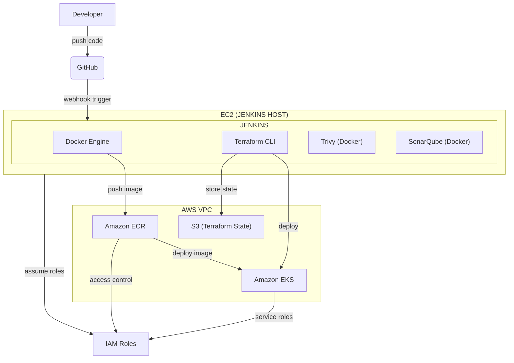

# Project Architecture

Here is a diagram of the project architecture:-

```mermaid
graph TD
    A[Developer] -- "push code" --> B(GitHub);

    subgraph ec2["EC2 (JENKINS HOST)"]
        subgraph jenkins["JENKINS"]
            C["Docker Engine"];
            D["Terraform CLI"];
            E["Trivy (Docker)"];
            F["SonarQube (Docker)"];
        end
    end

    subgraph awsvpc["AWS VPC"]
        G["Amazon ECR"];
        H["Amazon EKS"];
        I["S3 (Terraform State)"];
    end

    J[IAM Roles];

    B -- "webhook trigger" --> jenkins;
    C -- "push image" --> G;
    D -- "deploy" --> H;
    G -- "deploy image" --> H;
    D -- "store state" --> I;
    ec2 -- "assume roles" --> J;
    G -- "access control" --> J;
    H -- "service roles" --> J;
``` 
