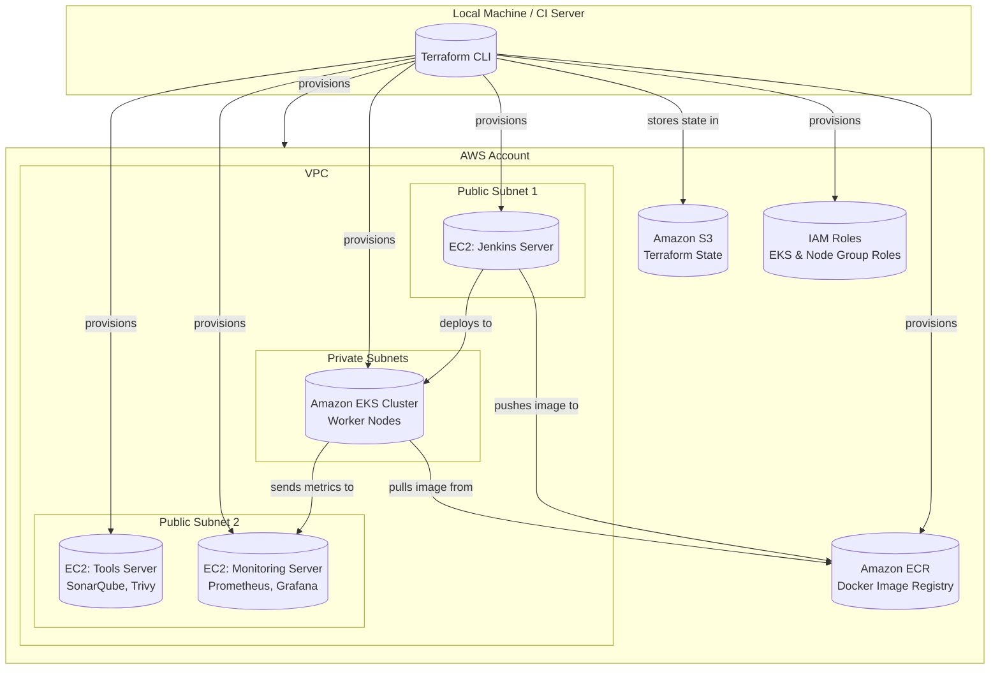

### Architecture Diagram

```mermaid
graph TD
    subgraph "AWS Account"
        subgraph "VPC"
            subgraph "Public Subnet 1"
                Jenkins[("EC2: Jenkins Server")];
            end
            subgraph "Public Subnet 2"
                Tools[("EC2: Tools Server<br/>SonarQube, Trivy")];
                Monitoring[("EC2: Monitoring Server<br/>Prometheus, Grafana")];
            end

            subgraph "Private Subnets"
                EKS[("Amazon EKS Cluster<br/>Worker Nodes")];
            end

            Jenkins -- "deploys to" --> EKS;
            EKS -- "sends metrics to" --> Monitoring;
        end

        ECR[("Amazon ECR<br/>Docker Image Registry")];
        S3[("Amazon S3<br/>Terraform State")];
        IAM[("IAM Roles<br/>EKS & Node Group Roles")];

        Jenkins -- "pushes image to" --> ECR;
        EKS -- "pulls image from" --> ECR;
    end

    subgraph "Local Machine / CI Server"
        Terraform[("Terraform CLI")];
    end

    Terraform -- "provisions" --> VPC;
    Terraform -- "provisions" --> EKS;
    Terraform -- "provisions" --> ECR;
    Terraform -- "provisions" --> Jenkins;
    Terraform -- "provisions" --> Tools;
    Terraform -- "provisions" --> Monitoring;
    Terraform -- "provisions" --> IAM;
    Terraform -- "stores state in" --> S3;
```
